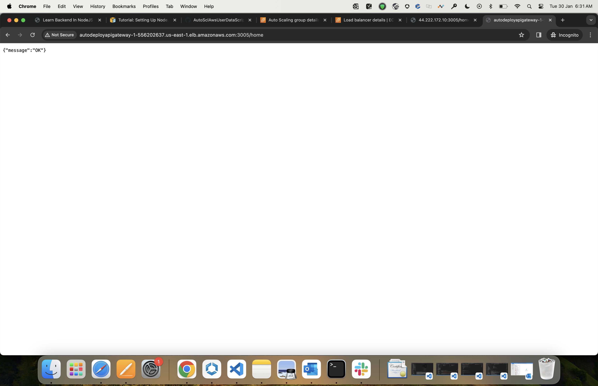

This repository is to explore the concepts around AWS from the Backend Development in NodeJS cohort.

AWS is Amazon Web Services, which is a cloud service provided by Amazon. Cloud, in the context of computer science, refers to remote machines or remote servers that are available to us for use.

The services which we explored in the cohort:

1. EC2: Elastic Cloud Compute: Virtual servers on the cloud

Some key terms:

Key: This contains certificates (in the form of .pem file) which are needed in order to SSH into the instance.

Security group: A set of firewall rules that control the traffic for the resource. We specify the ports and the protocols which with which our instance can interact.

Change the permission of the awskey by using `chmod 700 awskey.pem` (700 means read,write and execute permissions for the user, and 0 privilege for group and others)

SSH into the instance by using `ssh -v -i awskey.pem ubuntu@IP` 

1. **AWS Console on launching the EC2 instance**

2. **Terminal on launching the EC2 instance**

In the new instance, the first thing which we should ideally do is to run `sudo apt-get update`

After that, I looked up the documentation online to install NVM on the AWS instance.

I cloned the Flights API Gateway repository from [API Gateway](https://github.com/girikgarg8/API_Gateway). This is not the Flights API Gateway microsevice, it's a simple express server to test AWS's functionality.

Once cloned, we install the dependencies using `npm install` and then run the app by using `node index.js`

**Application running on EC2 instance:**

Try to send a HTTP request to the instance by sending request to 'IP:3005/home' through the browser.

The problem with this approach is that if I kill the node process, then the API on 'IP:3005/home' will also not work. Opening multiple terminals to SSH is not a recommended approach.

Hence,we set up a daemon process (background process) by using the 'pm2' package.

In order to start the daemon process, use `npx pm2 start index.js`. In order to stop the daemon process, use `npx pm2 stop index.js`

PM2 is a powerful package and can handle load balancing to some extent, by itself.

**Terminal on terminating the instance:**

**Let's explore deployment with autoscaling**

Scaling: Two Types

1. Horizontal scaling: Increasing the number of instances

2. Vertical scaling: Increasing the capabilities of the instance like increasing the RAM, hard disk size etc. It has the drawback that an instance can't be infinitely vertically scaled up.

In horizontal scaling, as we have different instances, we need to decide which instance the request will go to. This is taken care of by the load balancer, which montiors the health of each instance and redirects the requests accordingly.

Also, in horizontal scaling, we don't have a single point of failure.

Horizontal scaling can be setup in two different ways:

1. Manual horizontal scaling: In this mode, we need to manually spin an instance when the requests can't be handled by the existing instances.

2. Autoscaling: In this mode, AWS will automatically spin a new instance when the existing instances can't handle the incoming traffic.

Every microservice can have its own load balancers in AWS.

We need to define a launch template to tell what steps are needed in order to spin up a new instance on AWS.

We can get the script from [Auto Scaling AWS Script](https://github.com/girikgarg8/AutoSclAwsUserDataScript). 

Set up Auto Scaling Groups: 

An Auto Scaling group contains a collection of EC2 instances that are treated as a logical grouping for the purposes of automatic scaling and management.

In the auto scaling policy, we can configure details like the desired, minimum and maximum number of instances. We can also set up the scaling policy- when should the new instance be spun up- based on the CPU utilization, Average Network In, Average Network Out, Load Balancer Request count per instance.

We get the host name to the load balancer, and then we can send the request to load balancer. The load balancer is internally going to route it to one of the instances.

Load balancer in action:

In order to test whether the autoscaling functionality is working correctly, we will SSH into one of the instances and run some program which requires lot of computation. For my demo, I will be using a an infinite loop. We won't be able to send lot of traffic to the instance because we would be rate limited in that case.

Rate limiting by instance:

AWS spinning up new instances after the CPU threshold limit is reached:

![New instances being spun]

Before: 

[Before](./Before.png)

After: 

[After](./After.png)

The relevant instance template, security group, autoscaling group etc can be found on the AWS account associated with `girikgarg9@gmail.com`. 

Next up, we'll be setting up the databases on AWS and deploying containers on EC2 instances.